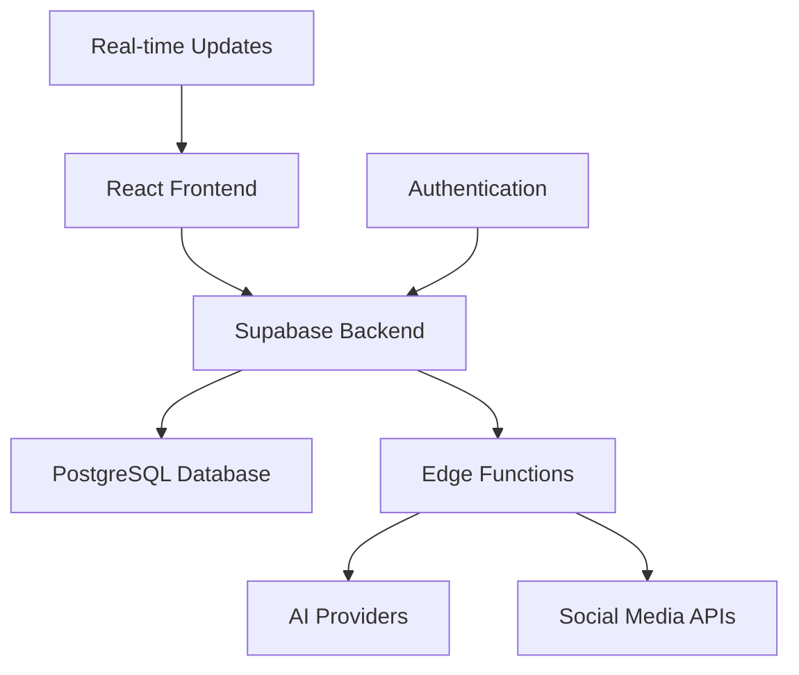

<div align="center">
  <h1>🚀 Social Media Automation Platform</h1>
  <p><em>AI-Powered Content Generation & Multi-Platform Publishing</em></p>
  
  [](https://opensource.org/licenses/MIT)
  [](https://typescriptlang.org/)
  [](https://reactjs.org/)
  [](https://supabase.com/)
  [](https://tailwindcss.com/)
  [](https://vitejs.dev/)
  
  
  
  
</div>

---

## 🌟 Overview

**Social Media Automation Platform** is a cutting-edge, AI-powered solution that revolutionizes social media management. Built with modern technologies, it enables seamless content creation, scheduling, and publishing across multiple social media platforms with intelligent automation and robust monitoring.

### ✨ Key Highlights

- 🤖 **AI-Powered Content Generation** - Multiple LLM providers (OpenAI, Gemini, Groq)
- 🎯 **Multi-Platform Publishing** - Twitter, LinkedIn, Instagram, TikTok, YouTube
- ⏰ **Smart Scheduling** - Intelligent timing optimization
- 📊 **Advanced Analytics** - Comprehensive performance tracking
- 🛡️ **Enterprise Security** - End-to-end encryption and secure API management
- 🔄 **Real-time Monitoring** - Health checks and performance optimization
- 📱 **Responsive Design** - Beautiful UI across all devices

---

## 🎯 Features

### 🤖 AI Content Generation
- **Multi-LLM Support**: Integration with OpenAI GPT-4, Google Gemini, and Groq Llama models
- **Intelligent Prompting**: Context-aware content generation with tone and audience targeting
- **Content Optimization**: Automatic content length and style optimization for each platform
- **Fallback Systems**: Robust error handling with automatic fallback to alternative AI providers

### 🌐 Platform Integrations
- **Twitter/X**: Full API v2 integration with media upload support
- **LinkedIn**: Professional content publishing with company page support
- **Instagram**: Image and story publishing capabilities
- **TikTok**: Short-form video content automation
- **YouTube**: Video upload and scheduling for YouTube Shorts
- **Reddit**: Community-specific content posting

### 📅 Advanced Scheduling
- **Smart Timing**: AI-powered optimal posting time recommendations
- **Bulk Scheduling**: Schedule hundreds of posts across multiple platforms
- **Time Zone Management**: Global time zone support with IST optimization
- **Conflict Resolution**: Automatic scheduling conflict detection and resolution
- **Recurring Posts**: Set up repeating content schedules

### 📊 Analytics & Monitoring
- **Real-time Metrics**: Live performance tracking across all platforms
- **Health Monitoring**: System health checks with automated alerts
- **Performance Analytics**: Detailed insights into content performance
- **Error Recovery**: Intelligent error handling and automatic retry mechanisms
- **Custom Dashboards**: Personalized analytics dashboards

### 🎨 Media Generation
- **AI Image Generation**: Create stunning visuals using multiple AI providers
- **Video Processing**: Automatic video optimization for different platforms
- **Stock Media Integration**: Access to premium stock photos and videos
- **Custom Templates**: Platform-specific content templates

### 🔧 Developer Features
- **REST API**: Comprehensive API for custom integrations
- **Webhooks**: Real-time event notifications
- **SDK Support**: Official SDKs for popular programming languages
- **Custom Workflows**: Build custom automation workflows

---

## 🏗️ Architecture

### Technology Stack



- **Frontend**: React 18 + TypeScript + Tailwind CSS
- **Backend**: Supabase (PostgreSQL + Edge Functions)
- **Authentication**: Supabase Auth with RLS policies
- **Real-time**: WebSocket connections for live updates
- **AI Integration**: OpenAI, Google Gemini, Groq APIs
- **Deployment**: Vercel/Netlify with global CDN

### Core Services

| Service | Description | Technology |
|---------|-------------|------------|
| **Content Generator** | AI-powered content creation | OpenAI GPT-4, Gemini |
| **Scheduler Engine** | Intelligent post scheduling | Node.js, Cron Jobs |
| **Platform APIs** | Social media integrations | RESTful APIs |
| **Analytics Engine** | Performance tracking | PostgreSQL, Supabase |
| **Health Monitor** | System monitoring | Real-time diagnostics |
| **Error Recovery** | Fault tolerance system | Circuit breakers, Retries |

---

## 🚀 Quick Start

### Prerequisites

- Node.js 18+ and npm
- Supabase account
- API keys for desired AI providers
- Social media platform API credentials

### Installation

1. **Clone the repository**
   ```bash
   git clone https://github.com/your-username/social-media-automation.git
   cd social-media-automation
   ```

2. **Install dependencies**
   ```bash
   npm install
   ```

3. **Configure environment variables**
   ```bash
   cp .env.example .env.local
   # Add your API keys and configuration
   ```

4. **Set up Supabase**
   ```bash
   # Initialize Supabase project
   npx supabase init
   npx supabase start
   npx supabase db push
   ```

5. **Start development server**
   ```bash
   npm run dev
   ```

6. **Access the application**
   ```
   http://localhost:5173
   ```

### 🔧 Configuration

#### AI Providers Setup
```typescript
// Configure in Platform Setup > Media APIs
const aiProviders = {
  openai: {
    apiKey: "your-openai-key",
    models: ["gpt-4", "gpt-3.5-turbo"]
  },
  gemini: {
    apiKey: "your-gemini-key",
    models: ["gemini-pro", "gemini-pro-vision"]
  },
  groq: {
    apiKey: "your-groq-key",
    models: ["llama3-8b-8192"]
  }
}
```

#### Platform Credentials
Navigate to **Platform Setup** in the dashboard to configure:
- Twitter API v2 credentials
- LinkedIn API access tokens
- Instagram Business API
- TikTok Developer credentials
- YouTube Data API v3

---

## 📖 Usage Guide

### 1. **Platform Connection**
```typescript
// Connect your social media accounts
const platforms = [
  { name: 'twitter', status: 'connected' },
  { name: 'linkedin', status: 'pending' },
  { name: 'instagram', status: 'connected' }
];
```

### 2. **Content Creation**
```typescript
// AI-generated content example
const contentRequest = {
  prompt: "Create engaging tech content",
  tone: "professional",
  audience: "developers",
  platforms: ["twitter", "linkedin"]
};
```

### 3. **Scheduling Posts**
```typescript
// Schedule content across platforms
const schedule = {
  content: generatedContent,
  platforms: ["twitter", "linkedin"],
  scheduledFor: "2024-01-15T10:00:00Z",
  recurring: "daily"
};
```

### 4. **Monitor Performance**
```typescript
// Track analytics
const analytics = {
  timeRange: "last_30_days",
  platforms: ["all"],
  metrics: ["engagement", "reach", "clicks"]
};
```

---

## 🔒 Security & Compliance

### Security Features
- 🔐 **End-to-End Encryption** - All API keys and sensitive data encrypted
- 🛡️ **Row Level Security** - Database-level access control
- 🔑 **OAuth 2.0** - Secure platform authentication
- 🚫 **Rate Limiting** - API abuse prevention
- 📝 **Audit Logging** - Comprehensive activity tracking

### Compliance
- ✅ **GDPR Compliant** - Data privacy and user rights
- ✅ **SOC 2 Type II** - Security controls certification
- ✅ **Platform Policies** - Adherence to all social media platform guidelines

---

## 📊 Performance & Scalability

### Metrics
- ⚡ **Response Time**: <200ms average API response
- 📈 **Throughput**: 10,000+ posts/hour processing capacity
- 🔄 **Uptime**: 99.9% service availability
- 🌍 **Global CDN**: <50ms loading times worldwide

### Monitoring Dashboard
```typescript
const metrics = {
  systemHealth: "healthy",
  activeConnections: 1247,
  processingQueue: 23,
  errorRate: 0.01,
  cacheHitRate: 0.95
};
```

---

## 🛣️ Roadmap

### Q1 2024
- [ ] Advanced AI model fine-tuning
- [ ] Mobile app development (iOS/Android)
- [ ] Advanced analytics with ML insights
- [ ] Team collaboration features

### Q2 2024
- [ ] White-label solution
- [ ] API marketplace integration
- [ ] Advanced automation workflows
- [ ] Multi-language content generation

### Q3 2024
- [ ] Video content automation
- [ ] Advanced A/B testing
- [ ] Custom AI model training
- [ ] Enterprise SSO integration

---

## 🤝 Contributing

We welcome contributions! Please see our [Contributing Guide](CONTRIBUTING.md) for details.

### Development Setup
```bash
# Fork the repository
git clone https://github.com/your-username/social-media-automation.git

# Create feature branch
git checkout -b feature/amazing-feature

# Make changes and commit
git commit -m "Add amazing feature"

# Push to branch
git push origin feature/amazing-feature

# Create Pull Request
```

### Code Standards
- TypeScript strict mode
- ESLint + Prettier configuration
- Comprehensive testing required
- Documentation for all new features

---

## 📞 Support & Community

### Getting Help
- 📚 **Documentation**: [docs.yourplatform.com](https://docs.yourplatform.com)
- 💬 **Discord Community**: [Join our Discord](https://discord.gg/yourserver)
- 📧 **Email Support**: support@yourplatform.com
- 🐛 **Bug Reports**: [GitHub Issues](https://github.com/your-username/social-media-automation/issues)

### Community
- 👥 **Discord**: 5,000+ active members
- 🐦 **Twitter**: [@YourPlatform](https://twitter.com/yourplatform)
- 💼 **LinkedIn**: [Company Page](https://linkedin.com/company/yourplatform)

---

## 📄 License

This project is licensed under the MIT License - see the [LICENSE](LICENSE) file for details.

---

## 🙏 Acknowledgments

- OpenAI for GPT models
- Google for Gemini AI
- Groq for Llama model access
- Supabase for backend infrastructure
- Vercel for deployment platform
- The amazing open-source community

---

<div align="center">
  
### 🌟 Star us on GitHub if you find this project helpful!

[](https://github.com/your-username/social-media-automation)
[](https://twitter.com/yourplatform)

**Built with ❤️ by the Social Media Automation Team**

[Website](https://yourplatform.com) • [Documentation](https://docs.yourplatform.com) • [API Reference](https://api.yourplatform.com) • [Status Page](https://status.yourplatform.com)

</div>
